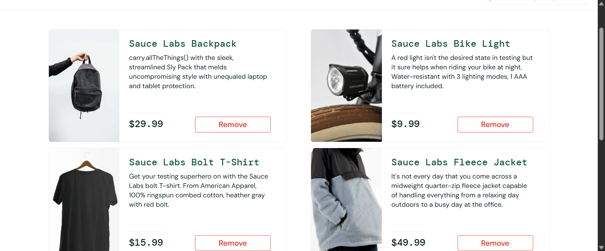
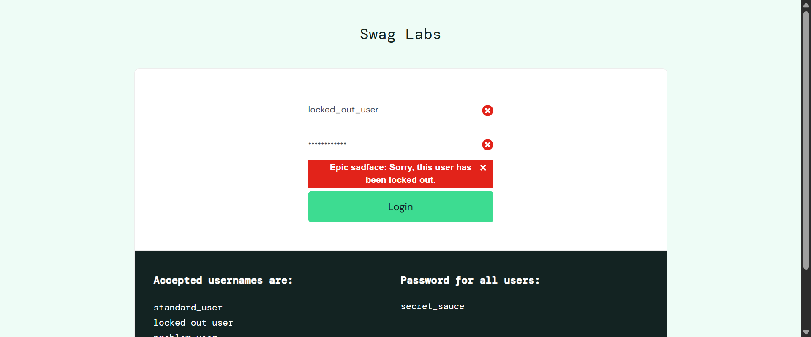

# Reporte de Pruebas Automatizadas: SauceDemo

**Nombre Completo:** Luis Emilio Jaras Sanchez
**Matrícula:** 243697
**Materia/Curso:** 2026.C2.Testing.Java
**Repositorio GitHub:** [GitHub Link](https://github.com/EmilioJaras3/2026.C2.Testing.Java.Luis_Emilio_Jaras_Sanchez.243697.tex-en-la-carpeta-Report)

---

## Índice
1. [Introducción](#1-introducción)
2. [Desarrollo](#2-desarrollo)
    - [Enfoque 1: Selenium con Java](#21-enfoque-1-selenium-con-java-selenium-java)
    - [Enfoque 2: Cypress](#22-enfoque-2-cypress-cypress-testing)
3. [Resultados y Capturas](#3-resultados-y-capturas)
4. [Conclusiones](#4-conclusiones)

---

## 1. Introducción

- **Proyecto:** Pruebas E2E en SauceDemo (https://www.saucedemo.com)
- **Herramientas Utilizadas:** Selenium (Java) y Cypress
- **Objetivo:** Iniciar sesión con los 6 usuarios de prueba proporcionados, agregar 4 artículos al carrito, validar el estado del carrito, generar logs en consola, y tomar capturas de pantalla de los resultados. Además, implementar el manejo de excepciones para los usuarios con errores intencionales de la plataforma.

---

## 2. Desarrollo

Se dividió el proyecto en dos enfoques principales y se organizó en carpetas separadas:

### 2.1 Enfoque 1: Selenium con Java (`/Selenium-Java`)

Se creó un proyecto en Maven utilizando JUnit 5 y WebDriverManager para facilitar la configuración del Chrome Driver.

**Implementación (`SauceDemoTest.java`):**
Mediante un `@ParameterizedTest`, se itera sobre la lista de 6 usuarios.
- **Acciones:** Login, espera explícita (`WebDriverWait`), agregar hasta 4 elementos y verificación del `shopping_cart_badge`.
- **Manejo de Errores:** Usuarios como `locked_out_user` fueron validados mediante comprobación del mensaje emergente de error. 
- **Capturas:** Al finalizar el escenario exitoso o la captura de una excepción, se toman capturas (*screenshots*) automatizadas y se guardan en la carpeta `/screenshots`.

**Comandos para ejecutar:**
1. Navegar a la carpeta: `cd Selenium-Java`
2. Ejecutar tests con Maven: `mvn test`

---

### 2.2 Enfoque 2: Cypress (`/Cypress-Testing`)

Se inicializó un proyecto de NPM y se instaló Cypress localmente.

**Implementación (`saucedemo.cy.js`):**
Se configuró el soporte para evitar que fallos del código interno de SauceDemo para el usuario `error_user` hicieran fallar a la suite mediante el manejador global `Cypress.on('uncaught:exception')`.
- **Acciones:** `cy.visit`, login, iteración de los contenedores para buscar los botones de _"Add to cart"_.
- **Manejo de Tiempos y UI:** A diferencia de Selenium, Cypress espera implícitamente a los elementos de UI, reduciendo la fricción.

**Comandos para ejecutar (CLI Headless):**
1. Navegar a la carpeta: `cd Cypress-Testing`
2. Ejecutar Cypress: `npx cypress run`

---

## 3. Resultados y Capturas

Las capturas resultantes se dividen en sus respectivas carpetas de proyecto. Algunas evidencias remarcables:

### Ejemplos Selenium Java (Éxito y Manejo de Errores Esperados)

### Ejemplos Cypress (Capturas de suite completa)
*(Rutas: `cypress/screenshots` tras la ejecución exitosa de todos los usuarios)*

---

## 4. Conclusiones

La automatización de un mismo flujo E2E (_End to End_) en dos herramientas diferentes permite contrastar enormemente sus enfoques:

1. **Selenium Java (Imperativo):** Requiere configuración explícita del Driver (WebDriverManager), tiempos de espera (`WebDriverWait`) y dependencias (Mvn, JUnit). Es altamente estricto, lo cual lo hace potente pero a la vez requiere mayor mantenimiento.
2. **Cypress (Declarativo y Asíncrono):** Su configuración con JSON/JS es sumamente sencilla. Emula al usuario de una manera natural en la web moderna e inyecta esperas por defecto que reducen la "flakiness" de las pruebas. Además, resolver problemas técnicos de la propia página (como excepciones internas) requirió solo interceptar el error a nivel del test runner sin ensuciar la lógica de negocio.

Manejar estos escenarios fallidos es esencial para la estabilidad de cualquier pipeline de CI/CD.
